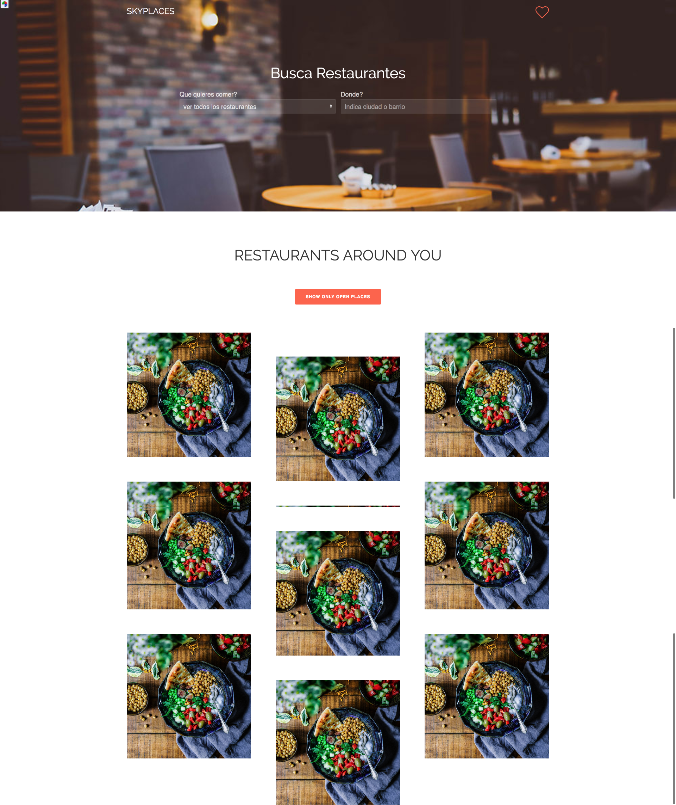

# Sky Places

Encuentra tu restaurante favorito por tipo de comida en cualquier ciudad.

## Getting Started

Puedes descargar o clonar este repositorio para testearlo.

### Prerequisites

Necesitas tener instalado npm o yarn. 

```
npm install o yarn install// 
npm run start o yarn start // 
```


## Functions

La app consiste de un buscador donde puedes seleccionar el tipo de restaurante que buscas y la ciudad o localidad. Una vez elegidos estos parametros se devolverá un grid de resultados.



Cuando seleccionas un restaurante se abrira un modal con la ficha del lugar (fotos, dirección, horarios, etc) 

(TO DO IMAGEN)

Si nos da tiempo tenemos pensado implementar distintas opciones de filtrado en la busqueda (mostrar solo restaurantes abiertos ahora) y añadir lugares a favoritos.


## Deployment

Puedes ver una demo en surge (TBD)

[Link a Trello](https://trello.com/b/LgrI7H4j/team-planning)

## Built With

* [React](https://reactjs.org/) - A JavaScript library for building user interfaces
* [uikit](https://getuikit.com/) - A lightweight and modular front-end framework
for developing fast and powerful web interfaces.
* [Google Places API](https://developers.google.com/maps/documentation/javascript/tutorial?hl=es-419) - Google Places API Web Service es un servicio que devuelve información sobre sitios


## Authors

* **Alexandra Spalato** - [alexadark](https://github.com/alexadark)
* **Asier Pérez** - [AsierDev](https://github.com/AsierDev)


## Acknowledgments

* ###  Ayuda en el proyecto 

    * *Manuel Barzi* - [manuelbarzi](https://github.com/manuelbarzi)
    * *Michel Escolano* - [Micheloncio](https://github.com/Micheloncio)
    * *Alejandro DZ * - [agandia9](https://github.com/agandia9)

